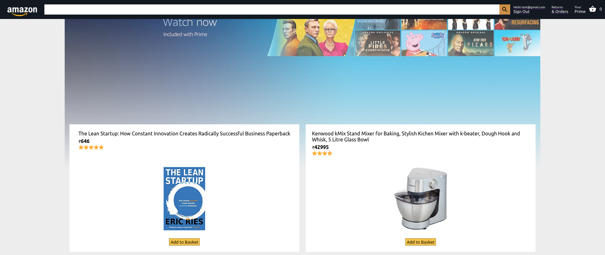

# Amazon Clone
This is a full stack clone of global e-commerce website <b>Amazon</b>. With this application a user can add, or remove items from the basket. They can place orders only after signing in or creating an account with a Email id and password. Users can place orders by making payment through debit or credit cards. Afer the successful payment the user will be redirected to the Orders page displaying the orders made by the user on the platform with the most recent one at the top.   

Deployed Link: https://clone-19369.web.app/

### Card details for testing payment
- Card Number: 4242 4242 4242 4242
- MM/YY: 04/24
- CVC: 242
- Zip: 42424

## Technology Used
- React for frontend
- Firebase for Login, User Authentication, and frontend deployment
- Firestore as database for storing information related to orders made by the users
- Stripe for enabling payments by users.
- Node, and Express for backend
- Heroku for backend deployment

## Learnings
In this project, I learned about using firebase for enablinng user authentication, database, and deployment. I also learned about using React Context API for state management. Stripe payment integration was something I never did before.
